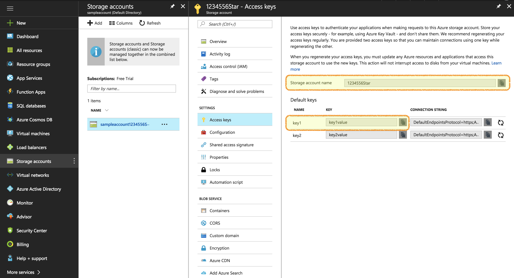

# Example 06 - Azure File Sync Integration

This example implements a Lambda Function that is triggered when a new file is
created in an S3 bucket of our choice. When the lambda is triggered the new file
is read and streamed into an Azure Storage share directory.


## Goal

The goal of this exercise is to learn how to trigger actions when a new file is created
in an S3 bucket and to see how we can get fancy and integrate AWS with other cloud providers
such as Microsoft Azure.


## Install dependencies

Before being able to run this example locally or to deploy it you need to download
the necessary dependencies in the src folder (`lessons/06-azure-file-sync-integrations/src`):

```
npm install
```


## Azure Account details

This example requires an Azure account and needs to be configured with proper `AZURE_ACCOUNT_NAME` and `AZURE_ACCOUNT_KEY` parametes.

You can get these values from your Azure dashboard as per the following screenshot:




## Test locally

With [lambda-local](https://www.npmjs.com/package/lambda-local) installed and your shell in this project folder (`lessons/06-azure-file-sync-integrations/`), run:

```bash
lambda-local -l src/handler.js -h handler -e sample-event.json
```


## Deploy on AWS

You can deploy on your AWS account with the following commands using [AWS cli](https://aws.amazon.com/cli/):

```
export BUCKET=your-unique-bucket-name
export AZURE_ACCOUNT_NAME=XXXX
export AZURE_ACCOUNT_KEY=YYYY
export STACK_NAME=azure-file-sync-integration

rm -f src.zip && cd src && zip -r ../src.zip . && cd ..

aws cloudformation package --template-file template.yml --s3-bucket $BUCKET --output-template-file packaged-template.yml

aws cloudformation deploy --template-file packaged-template.yml --stack-name $STACK_NAME --capabilities CAPABILITY_IAM --parameter-overrides AzureAccountName=$AZURE_ACCOUNT_NAME AzureAccountKey=$AZURE_ACCOUNT_KEY
```

Be sure to replace the value of `BUCKET` with your own unique bucket name and to
export the `AZURE_ACCOUNT_NAME` and `AZURE_ACCOUNT_KEY` variables with your own Azure account details


---


# Navigation

| << Prev | Next >> |
| :---         |          ---: |
| [05 - Weather Scrape Schedule](../05-weather-scrape-schedule)   | . |
